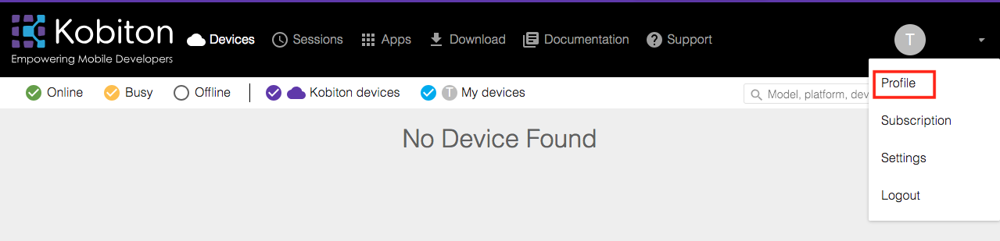
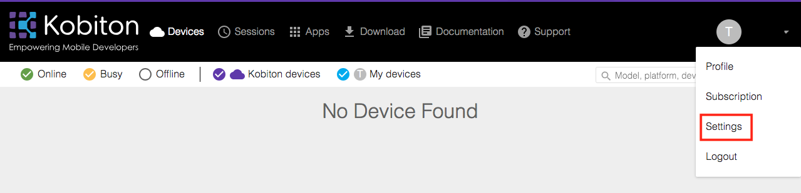
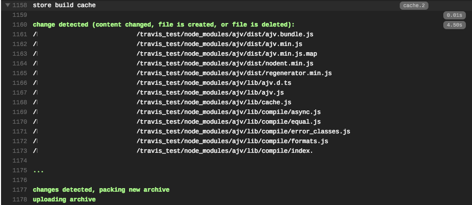

# Run Kobiton Automation Test on Travis CI
This guide will demonstrate how to run your Kobiton test on Travis CI and how to secure your secret environment variables

## Table of contents 
  - [Prerequisites](#prerequisites)
  - [1. Prepare Kobiton configuration for executing automation testing](#1-prepare-kobiton-configuration-for-executing-automation-testing)
  - [2. Configure environment variables in your .travis.yml file](#2-configure-environment-variables-in-your-travisyml-file)
  - [3. Write the automation test script](#3-write-the-automation-test-script)
  - [4. (Optional) Use cache to improve building speed](#4-optional-use-cache-to-improve-building-speed)

## Prerequisites
  - Github account.
  - Kobiton installed (Optional unless you want to test on real devices)
  - Kobiton account.
  - `travis` package installed.
    > run `gem install travis` on terminal to install it.

  >- For instruction on how to link Travis CI with Github repositories, follow [this guide.](https://docs.travis-ci.com/user/legacy-services-to-github-apps-migration-guide/)
  >- To trigger push commit with Travis CI in a Node JS project, follow [this tutorial](https://docs.travis-ci.com/user/languages/javascript-with-nodejs/) 
  >- More information about Travis CI can be found [here.](https://docs.travis-ci.com/)
  

## 1. Prepare Kobiton configuration for executing automation testing
* Kobiton Username
  1. Go to https://portal.kobiton.com
  2. In the upper right hand corner, click on User icon and in the drop down menu, click on `Profile`.  


  3. You should see the username.  


* Kobiton API key
  1. Click on User icon and select `Settings` on the drop down menu.
  

  2. Copy your API key under `API Keys`.  


* Desired capabilities  
  The desired capabilities need to be added to the Appium test script in order tests to be executed on the Kobiton device.
  1. In the navigation bar at the top of the Kobiton website, select Devices.
  2. Hover over any device and click on the Automation settings button (the gear symbol)
  
  1. You can choose your preferred language, testing type (Web/ App). Adjusting the settings on the left side will affect the desiredCaps in the right window.
  
  

## 2. Configure environment variables in your .travis.yml file
There are several methods to attach an enviroment variable to Travis CI.
In this guide, we will add our Username and API key to `.travis.yml` file. The API Key will be encrypted for security purposes.

1. In your repository directory, run:  
    `travis encrypt KOBITON_API_KEY={your_api_key_here} --add env.global`  
    This will add a secure encrypted key to your `.travis.yml`
2. Add necessary value (i.e username) to the template.
  
```
env:
  global:
    - KOBITON_USERNAME={your_kobiton_username}
    - secure: {your_encrypted_api_key}
```

The final outcome of `.travis.yml` file should look like this:
```
language: node_js
node_js:
  - '7'

env:  
 global:
  - KOBITON_USERNAME={your_kobiton_username}
  - secure: {your_encrypted_api_key}

script: {your_automation_script_run_command}
```
>For other methods, visit [here.](https://docs.travis-ci.com/user/environment-variables/)

## 3. Write the automation test script
1.  For samples of automation tests, go to https://github.com/kobiton/samples
2. Push your changes to Github and verify in Travis CI.  
3. Travis CI will export your environment variables from `.travis.yml`. The encrypted key will be showed as `[secured]`.
  
  

## 4. (Optional) Use cache to improve building speed
Travis CI will download and install your dependencies on every build attempt, which might reduce your performance if your project requires a large amount of dependencies that rarely change. For instance, in Node.js, dependencies are stored in the `node_module` folder.  
One recommended method is to save those dependencies in caches after your first successful build.  
Add these the commands below after `script` command in the `.travis.yml` file:  
```
cache:
  directories:
    - node_module
```
The final script should be:
```
language: node_js
node_js:
  - '7'

env:  
 global:
  - KOBITON_USERNAME={your_kobiton_username}
  - secure: {your_encrypted_api_key}

script: {your_automation_script_run_command}
cache:
  directories:
    - node_module
```

- Caches will be saved at the end of your build.
  


-------
You can now run automation tests with Kobiton from Travis!