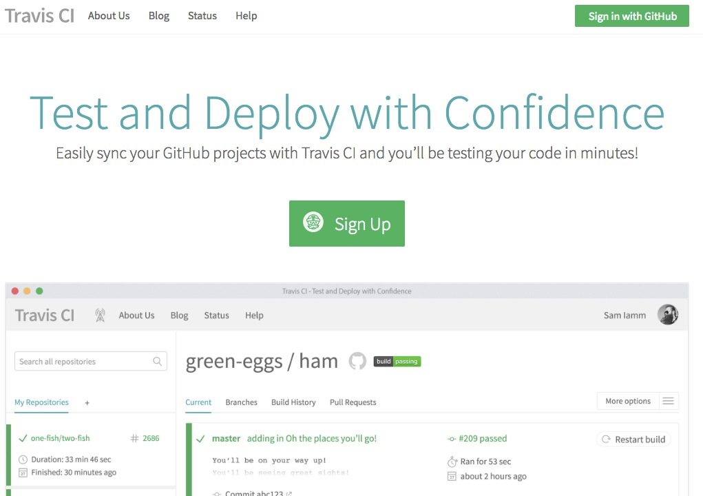
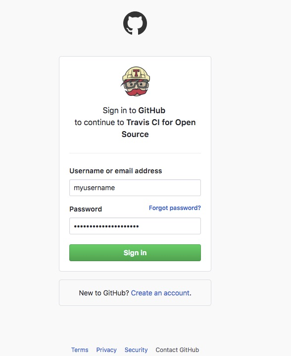
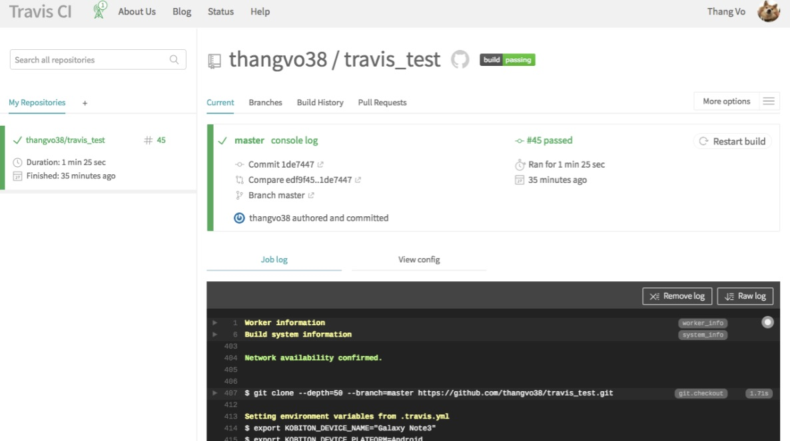

# Triggering a Travis build from a push to Github
This guild will teach you how to build your Github repository on Travis CI everytime you commit a push.

## 1.1 Sign in to Travis CI with your Github account
- Go to www.travis-ci.org and click on the "Sign in with Github" button in the upper right corner of the screen

- Enter your Github Id and Password then click "Sign in"

## 1.2 Sync your Github repository with Travis CI
- You can see a list of your Github repositories on the left. Click on the switch next to your repository's name to sync it to Travis CI.

- In this guide, I will use my "travis_test" repository as an example.

## 1.3 Configure .travis.yml file
- In order to enable Travis CI to build our project, we need a configuration file placed in your repository folder.
- Create a ".travis.yml" file in your project.

~~~
language: node_js
node_js:
  - '7'
script: npm run android-app-test
~~~

There are 3 major elements in the yml file as mentioned above:
- language: define the programming language of your project (My project is NodeJs so I'll put node_js in here)
~~~
  Other examples:
  - C#: csharp
  - Java: java
  - Python: python
~~~
- node_js: define the version of your language. In this case, I use Node version 7.
- script: the main script for travis to run. This is where you put your automation test script in.

Save the file and push your commit to Github.

As you can see, Travis CI will automatically update NodeJs and install every dependencies of your project (defined in package.json) and then run the test script.  
Once the building process is done, you can see the result in the dialog below.  

------
And that is how to trigger a Travis CI build from a push to Github.  
In [the next article](2-run-kobiton-test.md), I will demonstrate how to run Kobiton automation test on Travis and secure your ApiKey.

