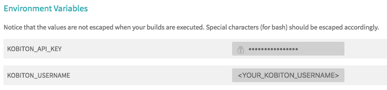
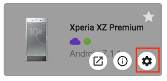
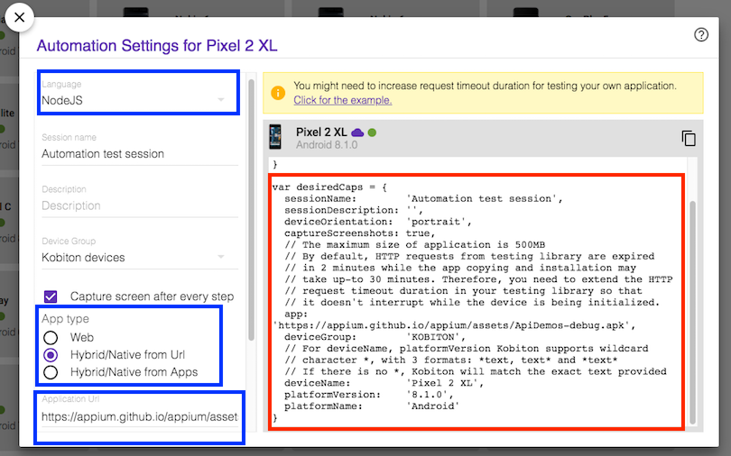
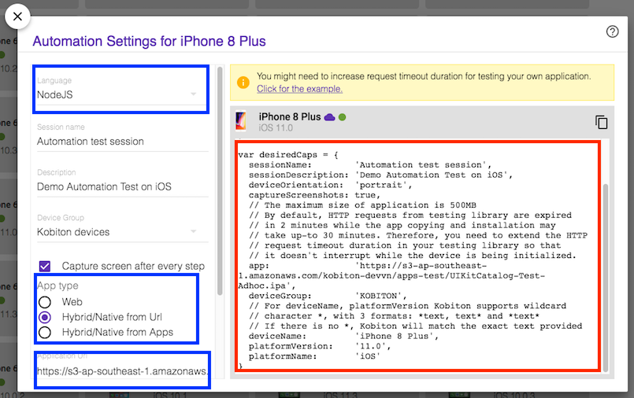
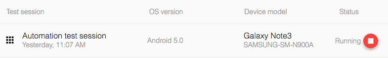

# Run Automation Test on Kobiton devices with Travis CI
This document will guide you how to use Travis CI to execute automation test on Kobiton devices everytime you push a commit to GitHub.

## Table of contents 
  - [A. Preparation](#a-preparation)
    - [1. Kobiton username and API key](#1-kobiton-username-and-api-key)
    - [2. Sample](#2-sample)
  - [B. Setup](#b-setup)
    - [1. Setting environment variables](#1-setting-environment-variables)
    - [2. Getting desired capabilities](#2-getting-desired-capabilities)
    - [3. Configuring automation test script](#3-configuring-automation-test-script)
    - [4. Configuring Travis CI](#4-configuring-travis-ci)
  - [C. Execution](#c-execution)
    - [1. Run automation script on Kobiton devices](#1-run-automation-script-on-kobiton-devices)
    - [2. Fetch session data through REST API](#2-fetch-session-data-through-rest-api)
  - [D. Feedback](#d-feedback)

## A. Preparation

## 1. Kobiton username and API key

In order to execute automation test on Kobiton devices, you need to prepare your Kobiton username and API key for authenticating with Kobiton. 
  
> Please visit https://portal.kobiton.com/register to create a new Kobiton account if you do not have one.

Follow instructions at `IV. Configure Test Scripts for Kobiton` section on [our blog article](https://kobiton.com/blog/tutorial/parallel-testing-selenium-webdriver/) to get Kobiton username and API key.

## 2. Sample

We have provided a sample for automation test with Travis CI configuration file in this repository.

The sample includes:
- Basic configuration for Travis CI (`.travis.yml`)
- Simple automation test script written in NodeJs. (`samples/automation-script` folder)

> After this guideline, you can make your own adjustment to meet your requirements.

To use the provided sample, follow these steps:

1. Fork this repository https://github.com/kobiton/Travis-HockeyApp-Appium-ReactNative/tree/master
2. Synchronize the forked repository with Travis CI. Visit [Travis CI document](https://docs.travis-ci.com/user/legacy-services-to-github-apps-migration-guide/#how-to-migrate-a-private-repository-to-github-apps) for detailed instruction.
3. Clone the forked repository.

The initial build on Travis CI will fail as we haven't done any configuration. Please follow instructions in the next parts to configure for automation testing.

## B. Setup

This part will guide you how to set your Kobiton username and API key as environment variables and apply Kobiton device's desired capabilities to your automation test script. After that, we will configure Travis CI to execute the test on your preferred platform (Android/ iOS)

## 1. Setting environment variables

  Go to your Travis CI build project settings.

  Add these two environment variable:
  
  -  KOBITON_USERNAME : Your Kobiton's username.
  -  KOBITON_API_KEY : Your Kobiton's API Key.
  
  Please make sure to hide `KOBITON_API_KEY` value so it won't be exposed in build log.
  
  The result should look like below:
  
  


## 2. Getting desired capabilities

  The desired capabilities need to be added to the automation test script in order for tests to be executed on the Kobiton device.

  Go to https://portal.kobiton.com and login to your Kobiton account.
  1. In the top navigation bar, select **"Devices"**.
  
  

  2. Pick an Android or iOs device if you want to execute tests on Android/ iOS apps. Hover over the chosen device and click on the Automation settings button (the gear symbol).
  
  

  1. In the popup window, you can choose the language of your test scripts and application type. The desired capabilities code will be generated in the right panel.

  In the provided sample scripts, we will be testing:
  - `ApiDemo-debug` app on `Pixel 2 XL 8.1.0` for Android.
    > Application URL: `https://appium.github.io/appium/assets/ApiDemos-debug.apk`

  - `UIKitCatalog-Test-Adhoc` app on `iPhone 8 Plus 11.0` for iOS.
  
    > Application URL: `https://s3-ap-southeast-1.amazonaws.com/kobiton-devvn/apps-test/UIKitCatalog-Test-Adhoc.ipa`

  In this guideline, we will choose **"NodeJS"** for *Language* and **"Hybrid/ Native from Url"** for *App type*. Paste the url we provided above in **"Application Url"**.

  Copy the code on the right (marked **red**) to prepare for the next step.

  

  

## 3. Configuring automation test script
  
  Navigate to `automation-script` folder.

  If you picked an Android devices in the previous step, open `android-app-test.js`. Otherwise, open `ios-app-test.js` for iOS devices.

  Replace the `desiredCaps` in your script with the one you got from the previous step.

  Desired capabilities for executing mentioned sample application above:

  For Android device (`android-app-test.js`):

  ```javascript
  const desiredCaps = {
    sessionName:        'Automation test session',
    sessionDescription: 'This is an example for Android app', 
    deviceOrientation:  'portrait',  
    captureScreenshots: true, 
    app:                'https://appium.github.io/appium/assets/ApiDemos-debug.apk', 
    deviceGroup:        'KOBITON', 
    deviceName:         'Pixel 2 XL',
    platformVersion:    '8.1.0',
    platformName:       'Android' 
  }
  ```

  For iOS device (`ios-app-test.js`):

  ```javascript
  const desiredCaps = {
    sessionName:        'Automation test session',
    sessionDescription: 'This is an example for iOS app', 
    deviceOrientation:  'portrait',  
    captureScreenshots: true, 
    app:                'https://s3-ap-southeast-1.amazonaws.com/kobiton-devvn/apps-test/UIKitCatalog-Test-Adhoc.ipa', 
    deviceGroup:        'KOBITON', 
    deviceName:         'iPhone 8 Plus',
    platformVersion:    '11.0',
    platformName:       'iOS' 
  }
  ```

  > Parameters description: https://docs.kobiton.com/automation-testing/desired-capabilities-usage/

>For more information on how to run automation test on Kobiton, visit:
  >- Kobiton documentation: https://docs.kobiton.com/automation-testing/automation-testing-with-kobiton/
  >- Kobiton's samples for automation test scripts in other languages: https://github.com/kobiton/samples

## 4. Configuring Travis CI

  Open `.travis.yml`.

  As automation testing script is written in NodeJS, we need to install NodeJS in Travis CI execution environment (`language: node_js`). We will also be using Travis CI to use the latest Node version for this build (`node_js: "node"`).

  ```yml
  language: node_js
  node_js: "node"

  before_install: cd ./sample
  install: npm install

  script: npm run <TEST_SCRIPT>
  ```

  Replace `<TEST_SCRIPT>` with `android-app-test` or `ios-app-test` depending on your desired platform.

  For executing tests on Android:

  ```yml
  script: npm run android-app-test
  ```

  For executing tests on iOS:

  ```yml
  script: npm run ios-app-test
  ```

## C. Execution

## 1. Run automation script on Kobiton devices

Push your modified test scripts and `.travis.yml` to your GitHub repository.

The environment variables for running automation test will be shown in build log. The encrypted API key will be showed as `[secured]`.

  

Travis CI will install the neccessary dependencies and then run the test on Kobiton.


By now your test session is created. Go to https://portal.kobiton.con/sessions to check your testing session status.



## 2. Fetch session data through REST API
Kobiton already provides a NodeJs sample on how to get session information using Kobiton REST API.

Go to https://github.com/kobiton/samples/tree/master/kobiton-rest-api and follow the instruction.

## D. Feedback

If you have any issue, you can contact Kobiton for more support.
1. Go to https://portal.kobiton.com
2. In the navigation bar at the top of the page, click on `Support`.
   


3. Fill in the information for your request and submit your ticket. 
  
 
