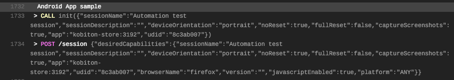
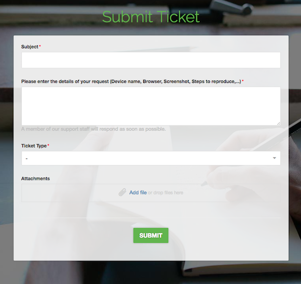

# Run Automation Test on Kobiton devices with Travis CI
This document will guide you how to use Travis CI to execute automation test on Kobiton devices everytime you push a commit to GitHub.

## Table of contents 
  - [A. Preparation](#a-preparation)
    - [1. Kobiton username and API key](#1-kobiton-username-and-api-key)
    - [2. Sample](#2-sample)
  - [B. Setup](#b-setup)
    - [1. Setting environment variables](#1-setting-environment-variables)
    - [2. Getting desired capabilities](#2-getting-desired-capabilities)
    - [3. Configuring automation test script](#3-configuring-automation-test-script)
    - [4. Configuring Travis CI](#4-configuring-travis-ci)
  - [C. Execution](#c-execution)
    - [1. Run automation script on Kobiton devices](#1-run-automation-script-on-kobiton-devices)
    - [2. Fetch session data through REST API](#2-fetch-session-data-through-rest-api)
  - [D. Feedback](#d-feedback)

## A. Preparation

## 1. Kobiton username and API key

In order to execute automation test on Kobiton devices, you need to prepare your Kobiton username and API key for authenticating with Kobiton. 
  
> Please visit https://portal.kobiton.com/register to create a new Kobiton account if you do not have one.

Follow instructions at `IV. Configure Test Scripts for Kobiton` section on [our blog article](https://kobiton.com/blog/tutorial/parallel-testing-selenium-webdriver/) to get Kobiton username and API key.

## 2. Sample

We have provided a sample for automation test with Travis CI configuration file in this repository.

In this repository, we have already provided samples for executing automation test in Kobiton:

- Script for executing automation test on Kobiton iOS devices (`/samples/automation-test/ios-app-test.js`).
- Script for executing automation test on Kobiton Android devices (`/samples/automation-test/android-app-test.js`).
- TravisCI configuration file (`/.travis.yml`).

> Note: After this guideline, you can make your own adjustment to meet your requirements.

To use the provided sample, follow these steps:

1. Fork this repository https://github.com/kobiton/Travis-HockeyApp-Appium-ReactNative/tree/masters
2. Synchronize the forked repository with Travis CI. Visit [Travis CI document](https://docs.travis-ci.com/user/legacy-services-to-github-apps-migration-guide/#how-to-migrate-a-private-repository-to-github-apps) for detailed instruction.
3. Clone the forked repository.

> Note: The initial build process on Travis CI will be failed to execuse as we haven't done any configuration. Please follow instructions in the next parts to configure for automation testing.

## B. Setup

## 1. Setting environment variables

  Go to your Travis CI build project settings.

  Add these two environment variable:
  
  -  KOBITON_USERNAME : Your Kobiton's username.
  -  KOBITON_API_KEY : Your Kobiton's API Key.
  
  Please make sure to hide `KOBITON_API_KEY` value so it won't be exposed in build log.
  
  The result should look like below:
  
  


## 2. Getting desired capabilities

  Kobiton has already provided two sample applications for testing on Android and iOS:

- Android: `ApiDemos-debug`

> Application URL: https://appium.github.io/appium/assets/ApiDemos-debug.apk

- iOS: `UIKitCatalog-Test-Adhoc`

> Application URL: https://s3-ap-southeast-1.amazonaws.com/kobiton-devvn/apps-test/UIKitCatalog-Test-Adhoc.ipa

In the provided sample automation test scripts, we have pre-configured them to execute the provided sample application(s) on one of the available device(s) that has the name `Galaxy` for Android and `iPhone` for iOS. If you want to use other specific device(s), follow the instruction below to get the corresponding desired capabilities for that device(s).

**How to get desired capabilities**

  In this tutorial, we will be showing how to get desired capabilities for executing automation test of provided sample application `ApiDemos-debug` on `Pixel 2 XL` running `Android 8.1.0`.

  Go to https://portal.kobiton.com and login to your Kobiton account.
  
  1. In the top navigation bar, select **"Devices"**.
  
  

  2. Hover over the device you want to run your test script on. Click on the Automation settings button (the gear symbol).
  
  

  3. In the "**Automation Settings**" popup:

  - In `Language` section, choose `NodeJS`.

  - In `App Type` section, choose `Hybrid/Native from Url`.

  - In `Application Url` field, replace it with the mentioned URL of `ApiDemos-debug` application.

  Copy the code on the right (marked **red**) to prepare for the next step.

  

## 3. Configuring automation test script
  
  In `samples/automation-test` folder, we have provided two sample scripts for executing automation test on Kobiton iOS and Android devices.

  As mentioned above, the desired capabilities in provided automation test scripts have already been pre-configured. If you have chosen custom desired capabilities, please follow steps below to apply the collected desired capabilities.

  **Setting desired capabilities**

  1. Open `android-app-test.js` if your desired capabilities is applicable for Android or `ios-app-test.js` if for iOS.

  2. Replace `desiredCaps` value with the one taken above.

  Example of desired capabilities for executing `ApiDemos-debug` application on `Pixel 2 XL` running `Android 8.1.0`:

  ```javascript
  const desiredCaps = {
    sessionName:        'Automation test session',
    sessionDescription: 'This is an example for Android app', 
    deviceOrientation:  'portrait',  
    captureScreenshots: true, 
    app:                'https://appium.github.io/appium/assets/ApiDemos-debug.apk', 
    deviceGroup:        'KOBITON', 
    deviceName:         'Pixel 2 XL',
    platformVersion:    '8.1.0',
    platformName:       'Android' 
  }
  ```

  > Parameters description: https://docs.kobiton.com/automation-testing/desired-capabilities-usage/

>For more information on how to run automation test on Kobiton, visit:
  >- Kobiton documentation: https://docs.kobiton.com/automation-testing/automation-testing-with-kobiton/
  >- Kobiton's samples for automation test scripts in other languages: https://github.com/kobiton/samples

## 4. Configuring Travis CI

  Open `.travis.yml`.

  As the sample automation testing script is written in NodeJS, we need to install NodeJS in Travis CI execution environment (`language: node_js`). We will also be using Travis CI to use the latest Node version for this build (`node_js: "node"`).

  ```yml
  language: node_js
  node_js: "node"

  before_install: cd ./samples/automation-script
  install: npm install

  script: npm run <TEST_SCRIPT>
  ```

  Replace `<TEST_SCRIPT>` with `android-app-test` or `ios-app-test` depending on which platform you want to test on.

  For executing tests on Android:

  ```yml
  script: npm run android-app-test
  ```

  For executing tests on iOS:

  ```yml
  script: npm run ios-app-test
  ```

## C. Execution

## 1. Run automation script on Kobiton devices

Push your modified test scripts and `.travis.yml` to your GitHub repository. TravisCI will then start the build process.

The environment variables for running automation test will be shown in build log. The encrypted API key will be showed as `[secured]`.

  

Travis CI will install the neccessary dependencies and then run the test on Kobiton.



By now your test session is created. Go to https://portal.kobiton.con/sessions to check your testing session status.


## 2. Fetch session data through REST API
Kobiton already provides a NodeJs sample on how to get session information using Kobiton REST API.

Go to https://github.com/kobiton/samples/tree/master/kobiton-rest-api and follow the instruction.

## D. Feedback

If you have any issue, you can contact Kobiton for more support.

1. Go to https://portal.kobiton.com

2. In the navigation bar at the top of the page, click on `Support`.
   


3. Fill in the information for your request and submit your ticket. 
  
 
