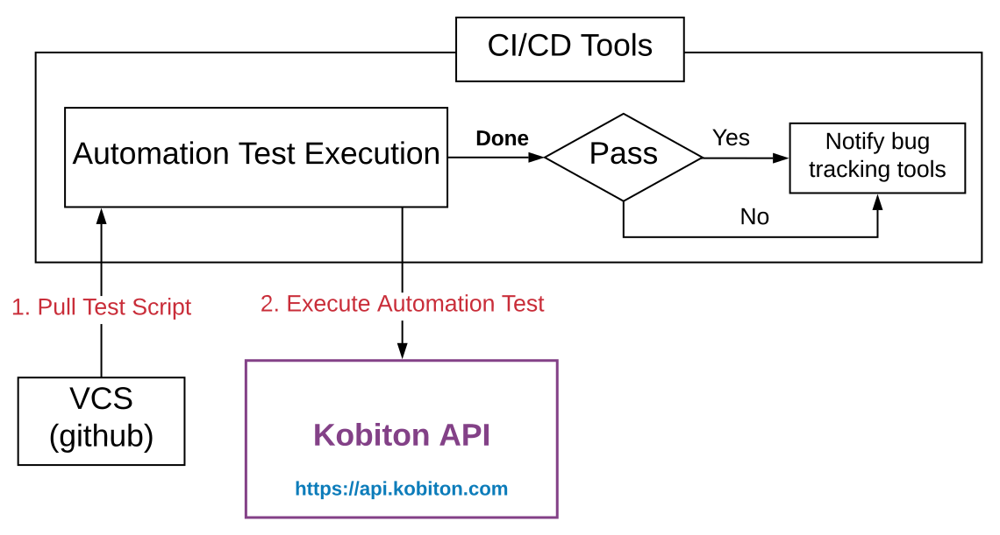

# Integrating Kobiton into TravisCI mobile application development pipeline

In mobile application development, perform testing on **real** devices before releasing is a crucial, but also costly process, which means that only few developers are able to perform testing on real devices, but only a very limited range of devices.

By integrating Kobiton into your mobile application development pipeline, TravisCI will be able to execute an automation testing on real devices, which help improve development process and product quality.

This guide is applicable if you are using these tools and technologies in your pipeline:
- ReactNative as a technology to develop the mobile application.
- Appium as a framework to develop the automation test scripts.
- TravisCI as a CI/CD tool.
- GitHub as a VCS provider to store your test scripts on.

Refer to [our documentation](./docs/README.md) for more details on how to integrate Kobiton with TravisCI.