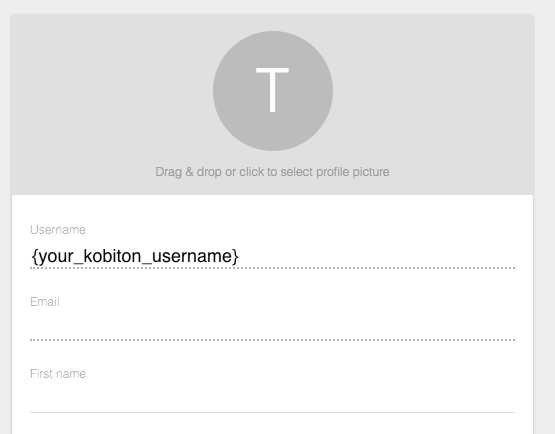
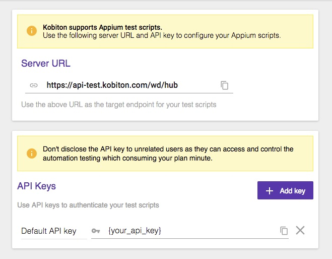
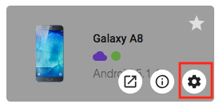
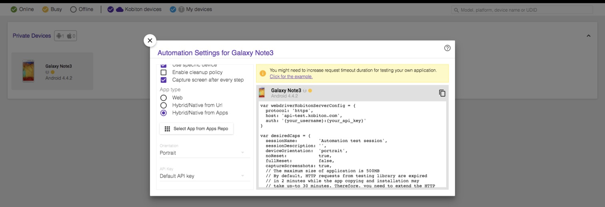
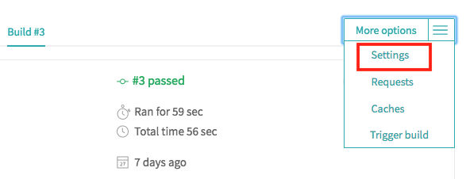
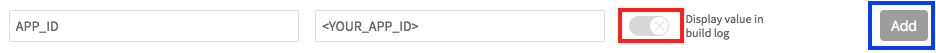
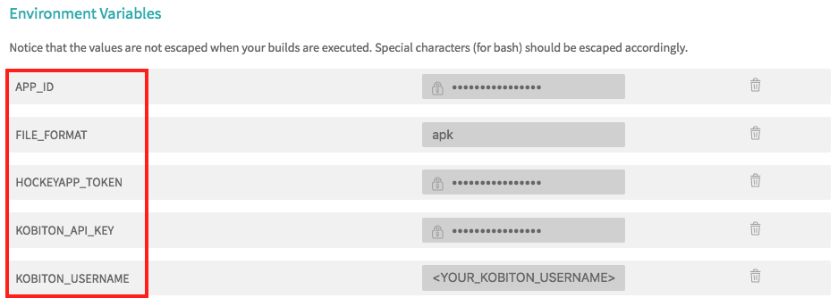
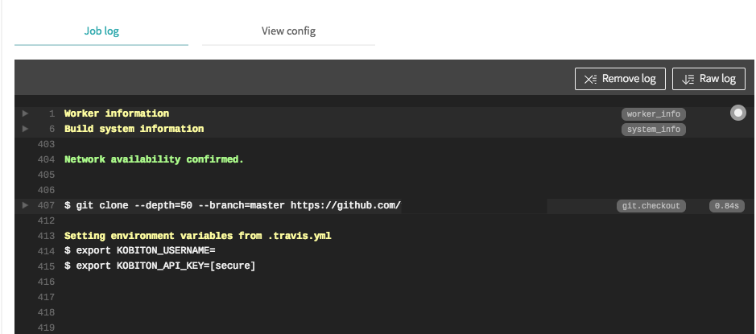
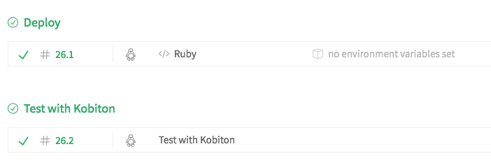

# Integrating Kobiton in app development pipeline with Travis CI
This document will guide you to prepare an app automation test project on GitHub and use Travis CI to automatically fetch the latest version and execute tests on Kobiton devices everytime you push a commit to GitHub.

## Table of contents 
[Prerequisites](#prerequisites)

[Preparation](#preparation)

[1. Configuring Travis CI with GitHub repository](#1-configuring-travis-ci-with-github-repository)

[2. Configuring automation test script](#2-configuring-automation-test-script)

[3. Adding required enviroment variables to Travis CI](#3-adding-required-enviroment-variables-to-travis-ci)

[4. Configuring to test latest app version on Kobiton devices](#4-configuring-to-test-latest-app-version-on-kobiton-devices)
  - [4.1. Fetching the latest app version and app download URL using Hockey App API](#41-fetching-the-latest-app-version-and-app-download-url-using-hockey-app-api)
  - [4.2 Adding test script execution command](#42-adding-test-script-execution-command)
  - [4.3 Setting Desired Capabilities](#43-setting-desired-capabilities)
  
[5. Executing your build](#5-executing-your-build)

[6. Fetching session data through REST API](#6-fetching-session-data-through-rest-api)

[7. Feedback](#7-feedback)

## Prerequisites
  - Kobiton account
  
  Please visit https://portal.kobiton.com/register to create new account.

## Preparation
We are going to assume you've already provided a full configured deployment pipeline from your React Native project to Hockey App using Travis CI.

We will also need to use Hockey App API to get neccessary information. Therefore, you might need to collect these variable:
- The `public indentifier` (app ID) of your app on Hockey App.
- A **Hockey App API token** for your app with `Full Access` or `Upload and Release` right.
> You can get these elements in your [Hockey App dashboard.](https://rink.hockeyapp.net/manage/dashboard)

This guideline will tell you how to collect these variables to run automation test on Kobiton:
- Kobiton username and API key.
- Desired captabilites of Kobiton devices to run automation test with.
- The latest version of your app as well as its download URL.

## 1. Configuring Travis CI with GitHub repository
  In order to trigger Travis CI with your GitHub project, we need to meet the following requirements:

  1. A GitHub repository that is synchronized with Travis CI.
  2. A `.travis.yml` file in your synced project that contains proper configurations. Travis CI will find the correct `yml` file to trigger the build on every push command.

  Firstly, let's assume you already have an empty GiHub repository for running automation test.

   In order to integrate Travis CI to a GitHub project, you may need a `.travis.yml` file in that GitHub repository.

   You can skip the this part if you've already integrated TravisCI with GitHub.
   > For instruction on how to sync GitHub repositories with Travis CI, follow [this guide.](https://docs.travis-ci.com/user/legacy-services-to-github-apps-migration-guide/)

  This documentation will use Node.js as the default language for the automation test script. Therefore, integrating Node.js plugin to Travis CI is required.
  > If you do not know how to integrate a Node JS app with Travis CI, follow [this tutorial.](https://docs.travis-ci.com/user/languages/javascript-with-nodejs/) 

## 2. Configuring automation test script
In order to run automation test on Kobiton devices, you will need to provide 3 variables: *your Kobiton username*, *your Kobiton API key* and the *desired capabilities*. This section will guide you to let those elements.

  **2.1 Get username and API key**   
  Go to https://portal.kobiton.com and login to your Kobiton account.
  - Get username
    * Select *user icon* -> **"Profile"** (you might find it in the top right corner of the navigation bar)
  
    
  - Get API key
    * Select *user icon* -> **"Settings"**
  
    

  **2.2 Get desired capabilities**  
    The desired capabilities need to be added to the automation test script in order tests to be executed on the Kobiton device.

  Go to https://portal.kobiton.com and login to your Kobiton account.
  * In the top navigation bar, select **"Devices"**.
    
  * Hover over any device you want to test with and click on the Automation settings button (the gear symbol)   
  
    
  * You can choose your preferred language, app type. In this guideline, we will choose **"NodeJS"** for *Language* and **"Hybrid/Native from Apps"** for *App type*. A block of code will be generated on the right column. Write down the code as we will be using it later.
  
    


## 3. Adding required enviroment variables to Travis CI

Because variables such as `API Key` and `Hockey App Token` are sensitive, we must secure these elements with Travis CI to use in our script.
1. Go to your Travis CI project.
2. Click on **"More options"** and select **"Settings"**
   


3. In the input dialog, type in your enviroment variables we need.
 
To secure sensitive variables, please make sure to **uncheck** **"Display value in build log"**

Click **"Add"** to confirm.



Here are the variables we need. For the sake of this guideline, please set the name for these variables like below

`APP_ID`: Your app ID

`FILE_FORMAT`: Your app file extension. `apk` for Android, `ipa` for iOS.

`HOCKEYAPP_TOKEN`: Hockey App API token

`KOBITON_API_KEY`: Your Kobiton API Key

`KOBITON_USERNAME`: Your Kobiton username



>For other methods to secure your enviromental variables, visit [here.](https://docs.travis-ci.com/user/environment-variables/)


## 4. Configuring to test latest app version on Kobiton devices

This section will guide you to fetch the latest version of your app on Hockey App and execute automation test on Kobiton devices with it.

The main steps of this section:
1. Use Hockey App API to get the latest app version and its download URL.
2. Setting desired capabilities
3. Adding test script execution command

### 4.1. Fetching the latest app version and app download URL using Hockey App API

To make things simplier, we have provided a bash script that will handle the first step as well as execute your automation test script.

Click [here](sample-scripts/test-with-kobiton.sh) and copy the file to your automation test folder.

This script will use Hockey App REST API to fetch your latest build version and your app's download link to 2 variables `VERSION` and `RESIGNED_URL`.

### 4.2 Adding test script execution command
Kobiton already provides some samples for automation test, visit [here](https://github.com/kobiton/samples) for reference.

**In this guideline, we will use the `Node.js` sample (`samples/javascript` folder) as an example.**

Open the `bash` file in the previous step.

At the end of the file, add a line to execute your automation test script based on this format:
```bash
VERSION=$version RESIGNED_URL=$resignedUrl <YOUR_AUTOMATION_SCRIPT_EXCEUTION_COMMAND>
```

Because we're using the Kobiton sample, we will use `android-app-test.js` as our automation test script. Therefore, the execution command in the end of the `bash` file should be like:
```bash
VERSION=$version RESIGNED_URL=$resignedUrl npm android-app-test
```

### 4.3 Setting Desired Capabilities
We will use Kobiton’s desired capabilities settings to configure your test scripts. Our settings include all the required configurations you need to automate your test using the Appium Framework and to run your automation test on real devices in the Kobiton cloud.

Open automation test script file or create a new one.

Replace `desiredCaps` in your script with ones you got from the previous step like the template below.
Notice the `app` element will be the value of `RESIGNED_URL` which is the download URL of your app.

```javascript
var desiredCaps = {
  sessionName:        'Automation test session',
  sessionDescription: '', 
  deviceOrientation:  'portrait',  
  captureScreenshots: true, 
  app:                process.env.RESIGNED_URL, 
  deviceGroup:        'KOBITON', 
  deviceName:         '<KOBITON_DEVICE_NAME>',
  platformVersion:    '<KOBITON_DEVICE_VERSION>',
  platformName:       '<DEVICE_PLATFORM_NAME>' 
} 
```

## 5. Configuring Travis CI
Testing with Kobiton should run dependently with deploying process. Therefore, we will put this section to a different build stage so that Travis CI will execute it only when the deploying stage is completed successfully.

Open `.travis.yml` file in your project

We will assume you already configured a `Deploy` stage for archiving Reat Native project and uploading the latest app version to Hockey App.

Create a new stage named `Test with Kobiton` for testing with Kobiton. 
```yml
jobs:
  includes:
    - stage: Deploy
    # Put your deploying script here
    - stage: Test with Kobiton
```

Because our automation test script is written in Node.js, we need to install the latest version of Node. Add these line under the new `stage` section.
```yml
language: node_js
node_js: "node"
```

To execute the `bash` script that we've prepared, put the path of the file in `script` section.
```yml
script: test-with-kobiton.sh
```

The final outcome of `.travis.yml` should look like this:
```yml
jobs:
  includes:
    - stage: Deploy
    # Put your deployment script here
    - stage: Test with Kobiton
    language: node_js
    node_js: "node"
    script: test-with-kobiton.sh
```

## 5. Executing your build
Once you have got everything set up, push your changes to GitHub to verify the build in Travis CI.  
Travis CI will export your environment variables from `.travis.yml`. The encrypted key will be showed as `[secured]`.
  
  

After deploying the latest version to Hockey App, Travis CI will fetch the latest app version's download URL and use it to execute test on Kobiton.


You can go to https://portal.kobiton.con/sessions to check your testing session status.


Once the testing is completed, you can check out for the build result in Travis CI website.



## 6. Fetching session data through REST API
Kobiton already provides a Node.js sample on how to get session information using Kobiton REST API.

Go to https://github.com/kobiton/samples/rest-api and follow the instruction.

## 7. Feedback
If you have any issue, you can contact Kobiton for more support.
- Go to https://portal.kobiton.com
- In the navigation bar at the top of the page, click on `Support`.


- Fill in the information for your request and submit your ticket. 
  
 
